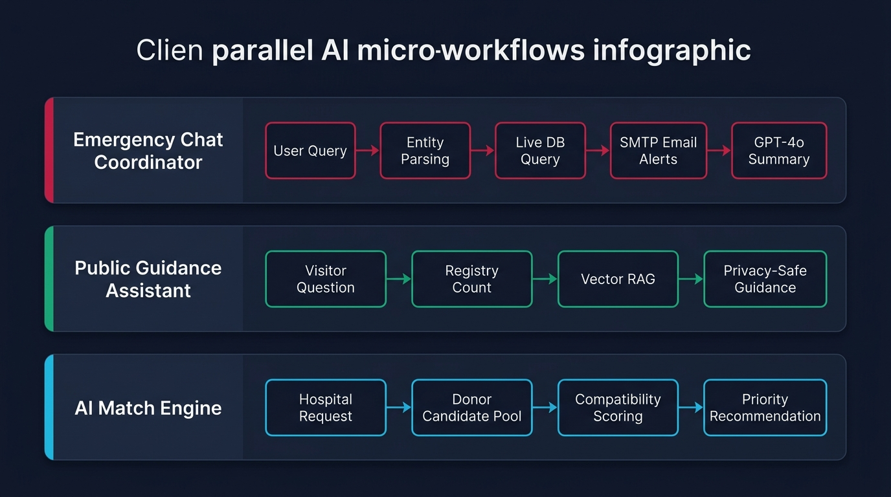

# 🤖 Smart Blood Hub - AI System Architecture & Workflows

A detailed architectural specification and visual guide for the **Smart Blood Hub AI System**.

---

## 📊 End-to-End System Architecture

The high-level pipeline illustrates how incoming natural language queries and hospital emergency blood requests are parsed, augmented with real-time vector and relational context, reasoned through OpenAI's LLM, and executed with automated dispatch actions.


### 🔄 Architecture Flow Breakdown

| Component | Responsibility | Technologies |
| :--- | :--- | :--- |
| **1. User & Hospital Ingestion** | Natural language queries (`/ai/chat`), triage requests (`/ai/match-request`), public queries (`/ai/public-chat`). | FastAPI, Pydantic, REST |
| **2. Entity & Intent Parsing** | Extracts target blood group (`AB+`, `O-`, etc.), location keywords, and distinguishes between emergency search and general inquiry. | Regex entity extraction, Python NLP heuristics |
| **3. Pinecone Vector RAG** | Vectorizes text via `text-embedding-3-small` and retrieves semantic blood bank protocols, compatibility rules, and policies. | Pinecone Vector Store, OpenAI Embeddings |
| **4. MongoDB Atlas Live Data** | Real-time queries for verified available donors, local supply counts, and emergency post queues. | MongoDB Atlas, Motor/PyMongo |
| **5. OpenAI LLM Reasoning Engine** | Synthesizes live database state, RAG protocols, and query intent to generate structured triage analysis. | OpenAI GPT-4o-mini |
| **6. Automated Action Dispatch** | Fires immediate SMTP alert emails to matching donors in the target area and records audit logs. | aiosmtplib, Python smtplib |

---

## 🧩 The 3 Core AI Micro-Workflows

The Smart Blood Hub AI subsystem operates across three specialized pipelines:



### 1. 🚨 Emergency Chat Coordinator
- **User Query** ➡️ **Entity Parsing** (Blood Group & Location) ➡️ **Live DB Query** (Matching Donors) ➡️ **SMTP Email Alerts** ➡️ **GPT-4o Summary Report**
- Dispatches emergency notifications to verified donors immediately upon request.

### 2. 💬 Public Guidance Assistant
- **Visitor Question** ➡️ **Registry Count** ➡️ **Vector RAG Knowledge Search** ➡️ **Privacy-Safe Guidance**
- Answers blood compatibility and donation interval questions while protecting donor privacy.

### 3. 🎯 AI Match Engine
- **Hospital Request** ➡️ **Donor Candidate Pool** ➡️ **Compatibility Scoring** ➡️ **Priority Recommendation**
- Analyzes candidate donor pools against critical hospital requirements to determine suitability.

---

## 📁 Repository AI Directory Structure

```
hemoglobin-ai/
├── ai-system/                        <-- 🤖 Standalone Dedicated AI Microservice
│   ├── main.py                       # FastAPI entrypoint (Port 8002)
│   ├── config.py                     # AI settings (OpenAI & Pinecone)
│   ├── agent.py                      # LLM Agent, Parsing & Coordinator
│   ├── rag.py                        # Pinecone RAG Vector Pipeline
│   ├── prompts.py                    # System prompts & guidelines
│   ├── db.py                         # MongoDB Atlas client & fallback
│   ├── schemas.py                    # Pydantic request models
│   ├── requirements.txt              # Dedicated Python requirements
│   ├── Dockerfile                    # Containerization config
│   └── tests/                        # Standalone AI unit tests
│
├── backend/                          <-- 🌐 Main Backend Service
│   ├── ai/                           # AI flow module
│   ├── core/                         # Config, database, auth, emailer
│   ├── routers/                      # Modular API controllers
│   ├── schemas/                      # Unified Pydantic models
│   └── main.py                       # Backend server entrypoint
│
└── frontend/                         <-- 💻 Next.js Web Interface
```

---

## 🚀 Running the Standalone AI Service

```bash
cd ai-system
pip install -r requirements.txt
uvicorn main:app --host 0.0.0.0 --port 8002 --reload
```
