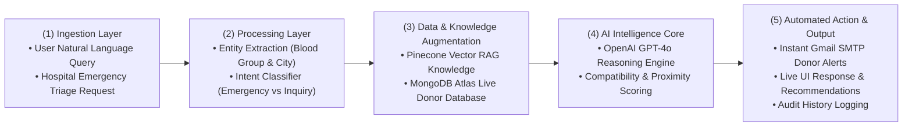

# 🤖 Smart Blood Hub - AI System Architecture & Workflows

A detailed architectural specification and visual guide for the **Smart Blood Hub AI System**.

---

## 🏛️ AI System Architecture Blueprint

The high-level architecture diagram illustrates the multi-tier microservice design connecting the Next.js frontend, core API services, dedicated AI subsystem, vector RAG pipeline, and external cloud infrastructure.


### 🧩 3-Tier Architecture Overview

| Layer / Tier | Component | Responsibilities & Technologies |
| :--- | :--- | :--- |
| **1. Client Tier** | **Next.js Web Client** | Responsive UI featuring AI Assistant Chat, Live Emergency Request Feed, Donor Registry, Direct Peer-to-Peer Messaging, and System Activity Logs. Built with React 19, TypeScript, and Tailwind CSS. |
| **2. Backend Services Tier** | **Core Backend API Service** *(FastAPI, Port 8000)* | Manages user registration, JWT authentication, emergency post lifecycle, donor directory, direct messages, and system audit logs. |
| | **Dedicated AI Subsystem** *(FastAPI, Port 8002)* | Autonomous LLM agent orchestrator, entity & intent parser, Pinecone RAG semantic retriever, and automated SMTP dispatch engine. |
| **3. External Infrastructure Tier** | **MongoDB Atlas** | Primary relational document store for verified donors, active emergency posts, direct messages, and chat history. |
| | **Pinecone Vector Cloud** | Vector knowledge store indexed with `text-embedding-3-small` containing clinical blood donation guidelines, eligibility rules, and protocols. |
| | **OpenAI GPT-4o API** | Advanced reasoning model executing contextual queries, triage synthesis, and donor candidate scoring. |
| | **Gmail SMTP Dispatcher** | High-priority email notification channel alerting matched donors in real-time during critical shortages. |

---

## 📊 End-to-End AI Decision & Workflow Pipeline

The diagram below depicts the 5-stage AI pipeline from raw user and hospital ingestion to automated multi-channel dispatch actions.


### 🔄 5-Stage AI Flow Breakdown



| Stage | Responsibility | Operations |
| :--- | :--- | :--- |
| **(1) Ingestion Layer** | Endpoint ingestion | Accepts unstructured messages via `/ai/chat`, `/ai/public-chat`, and structured triage payloads via `/ai/match-request`. |
| **(2) Processing Layer** | Entity & Intent Parsing | Regex and heuristics extract target blood groups (`A+`, `O-`, `AB-`, etc.) and geographical locations while classifying emergency urgency. |
| **(3) Data & Knowledge Augmentation** | Vector RAG & Live Database | Queries Pinecone for medical compatibility context and queries MongoDB Atlas for verified available donors in the target city. |
| **(4) AI Intelligence Core** | LLM Reasoning & Scoring | Synthesizes retrieved medical guidelines and live database state to evaluate candidate donor pools and generate actionable triage recommendations. |
| **(5) Automated Action & Output** | Dispatch & Persistence | Sends automated SMTP emails to matching donors, renders clear UI recommendations for hospitals, and logs audit events for traceability. |

---

## 📁 Repository Directory Structure

```
hemoglobin-ai/
├── ai-system/                        <-- 🤖 Standalone Dedicated AI Microservice
│   ├── main.py                       # FastAPI entrypoint (Port 8002)
│   ├── config.py                     # AI settings (OpenAI & Pinecone)
│   ├── agent.py                      # LLM Agent, Parsing & Coordinator
│   ├── rag.py                        # Pinecone RAG Vector Pipeline
│   ├── prompts.py                    # System prompts & guidelines
│   ├── db.py                         # MongoDB Atlas client & fallback
│   ├── schemas.py                    # Pydantic request models
│   ├── requirements.txt              # Dedicated Python requirements
│   ├── Dockerfile                    # Containerization config
│   ├── docs/                         # Architecture & flow diagrams
│   └── tests/                        # Standalone AI unit tests
│
├── backend/                          <-- 🌐 Main Backend Service
│   ├── ai/                           # AI flow module
│   ├── core/                         # Config, database, auth, emailer
│   ├── routers/                      # Modular API controllers
│   ├── schemas/                      # Unified Pydantic models
│   └── main.py                       # Backend server entrypoint (Port 8000)
│
├── frontend/                         <-- 💻 Next.js Web Interface
│   ├── src/app/                      # Next.js app router pages
│   ├── src/components/               # UI components (Feed, Registry, Chat, Logs)
│   └── src/services/api.ts           # Unified API client
│
└── docs/                             # System Architecture & Flow Diagrams
    ├── ai_flow.jpg                   # AI Flow & Decision Pipeline diagram
    └── ai_system_architecture.jpg    # 3-Tier System Architecture blueprint
```

---

## 🚀 Running the Services

### Dedicated AI Microservice (Port 8002)
```bash
cd ai-system
pip install -r requirements.txt
uvicorn main:app --host 0.0.0.0 --port 8002 --reload
```

### Core Backend Service (Port 8000)
```bash
cd backend
pip install -r requirements.txt
uvicorn main:app --host 0.0.0.0 --port 8000 --reload
```

### Frontend Application (Port 3000)
```bash
cd frontend
npm install
npm run dev
```
