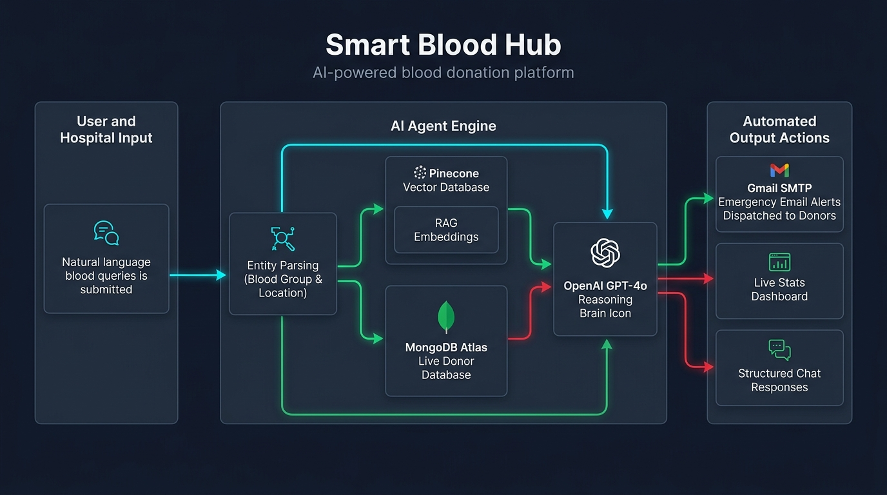

# 🩸 Smart Blood Hub (Hemoglobin AI)

An AI-powered emergency blood donor registry, automated dispatch coordinator, and intelligent triage platform.



## 📂 Monorepo Architecture

- **`ai-system/`** — Standalone dedicated AI microservice (FastAPI, OpenAI GPT-4o, Pinecone Vector RAG).
- **`backend/`** — Main backend microservice for donors, user auth, emergency posts, messaging, SMTP alerts, and audit logs.
- **`frontend/`** — Next.js 14 web application for users, hospitals, and donors.
- **`docs/`** — Architecture diagrams and assets.

For full architectural details and flow diagrams, see [AI_SYSTEM_ARCHITECTURE.md](AI_SYSTEM_ARCHITECTURE.md).

---

## 🚀 Running Locally

### 1. Dedicated AI System Microservice
```bash
cd ai-system
pip install -r requirements.txt
python main.py
```

### 2. Main Backend
```bash
cd backend
pip install -r requirements.txt
python main.py
```

### 3. Frontend Application
```bash
cd frontend
npm install
npm run dev
```

---

## ⚙️ Environment Configuration

- `ai-system/.env.example`
- `backend/.env.example`
- `frontend/.env.example`

Copy each example file to `.env` or `.env.local` with your respective credentials (OpenAI, Pinecone, MongoDB Atlas, Gmail SMTP).
