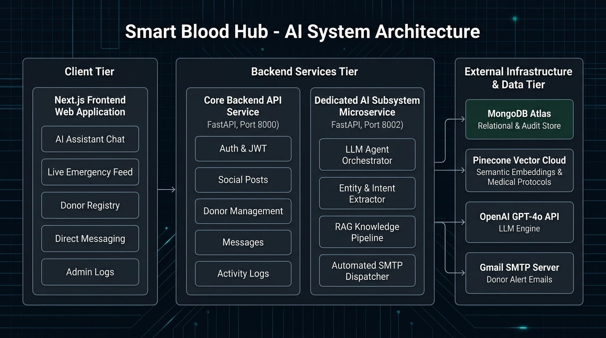
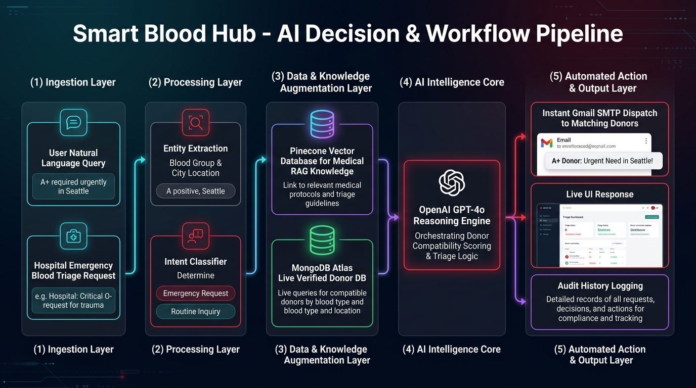

# 🤖 Smart Blood Hub - Dedicated AI System

A standalone microservice and core package dedicated **exclusively** to the AI System of Smart Blood Hub.



---

## 📊 AI Decision & Workflow Pipeline



---

## 🚀 Features

- **OpenAI LLM Reasoning Engine**: Natural language understanding, donor suitability analysis, and emergency query triage.
- **Pinecone Vector RAG**: Semantic similarity matching and automated retrieval of blood bank medical and logistics knowledge.
- **Intent Recognition & Entity Extraction**: Automatically parses blood groups (`A+`, `O-`, etc.) and target locations from unstructured messages.
- **Matching & Priority Dispatch Logistics**: Generates AI recommendations for incoming blood requests against candidate donor pools.
- **Zero Monolithic Dependencies**: Contains only the AI system components (no general CRUD, user management, or UI logic).

---

## 📂 Architecture

```
ai-system/
├── main.py             # Standalone FastAPI microservice entrypoint (Port 8002)
├── config.py           # AI System configuration & environment settings
├── agent.py            # AI Coordinator, intent parsing & LLM execution
├── rag.py              # Pinecone embeddings & semantic knowledge retrieval
├── prompts.py          # System prompt engineering and guidelines
├── schemas.py          # Pydantic data schemas for AI requests & responses
├── requirements.txt    # Dedicated lightweight Python dependencies
├── Dockerfile          # Container definition
├── docs/               # Architecture diagrams
├── tests/              # Dedicated AI unit tests
└── README.md
```

---

## 🛠️ Quickstart

### 1. Install Dependencies
```bash
cd ai-system
pip install -r requirements.txt
```

### 2. Environment Configuration
Create a `.env` file or export the following variables:
```env
OPENAI_API_KEY=sk-...
OPENAI_MODEL=gpt-4o-mini
OPENAI_EMBEDDING_MODEL=text-embedding-3-small
PINECONE_API_KEY=...
PINECONE_INDEX_NAME=hemoglobin-knowledge
```

### 3. Run the AI Microservice
```bash
uvicorn main:app --host 0.0.0.0 --port 8002 --reload
```

---

## 📡 API Endpoints

- `GET /health` - Health status of AI service & connected AI providers
- `POST /ai/chat` - Main AI coordinator chat with donor matching analysis
- `POST /ai/public-chat` - Public guidance chat
- `POST /ai/match-request` - Structured AI matching logistics recommendations
- `POST /ai/knowledge` - Index documents into the Pinecone RAG vector store
